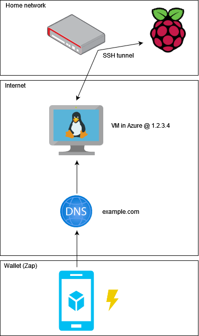
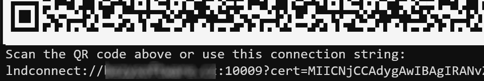

# Lightning server proxy
Pár skriptů pro zpřístupnění vašeho privátního LND serveru zkrze veřejný proxy server. 

## Motivace
Představte si, že už máte rozběhnutý bitcoin/lightning node na vašem domácím serveru (třeba Raspberry Pi) a chcete k němu připoji mobilní peněženku. Je dost velká šance, že používáte něco ve stylu [Umbrelu](https://getumbrel.com/), který se o všechno stará a umožní přístup skrz onion adresu. Na mobilu si nainstauleje peněženku [Zap](https://github.com/LN-Zap/) nebo podobnou a skrze danou onion adresu s k ní přes Tor přípojíte. Všechno funguje.

Pak ale při návštěvě kavárny při placení zjistíte, že připojování k síti Tor trvá nějak dlouho. Tak zkusíte aplikaci restartovat. Pořád startuje, už desítky vteřin. Za vámi se zatím vytvořila fronta, vy zpanikaříte a raději zaplatíte kartou. 

Nebo prostě Tor nepoužíváte, máte node schovaný za routerem a nechcete zapínat port forwarding. Nebo prostě nemáte statickou IP adresu.

Nebo chcete používat LN-URL.

## Řešení
Jedním z řešení je mít veřejně přístupný server, který bude sloužit jako proxy a směrovat požadavky na ten váš privátní  (Raspberry). To lze jednoduše zařídit přes SSH. High-level pohled pak bude vypadat nějak takhle:



Co přesně bude váš veřejný server je na vás, v tomto příkladu používám Azure VM (e.g. [Standard_B1s](https://docs.microsoft.com/en-us/azure/virtual-machines/sizes-b-series-burstable) - 1 vcpu, 1 GiB memory ~ 6.5€/měsíc).

Taky budete potřebovat vlastní doménu, e.g. `example.com`, kterou pomocí A Recordu nasměrujete na statickou IP adresu vašeho serveru.

## Nastavení

Budu předpokládat, že už máte vlastní doménu, server a Raspberry Pi na kterém běží Umbrel.

1. Git clone na váš Raspberry Pi: 
```bash
ssh umbrel@umbrel.local
git clone https://github.com/bezysoftware/lightning-proxy.git
```
2. Spusťte script a následujte instrukce
```bash
cd ./lightning-proxy/scripts
sudo ./setup.sh
```

Co to udělá:
1. Vygeneruje SSH pár a zobrazí veřejný klíč, který musíte zadat do vašeho serveru, aby s k němu Raspberry mohl připojit (v Azure Portal to je VM -> Reset Password -> SSH)
2. Nastaví [AutoSSH](https://www.everythingcli.org/ssh-tunnelling-for-fun-and-profit-autossh/) službu, která bude přesměrovávat traffic na portu 10009 a sama se bude spouštět a monitorovat
3. Donutí LND přegenerovat svůj certifikát s vaší doménou (vyžaduje docker container restart)
4. Zobrazí LND connection string a QR code, který stačí ve walletce naskenovat



5. Povolí přesměrování portů "zvenku" vašeho serveru (by default je povoleno přesměrování pouze pro požadavky z localhostu). 

Taky na VM nainstaluje `net-tools` aby šel používat příkaz `netstat` pro monitorování portů:
```bash
sudo netstat -tulpn | grep LISTEN
``` 